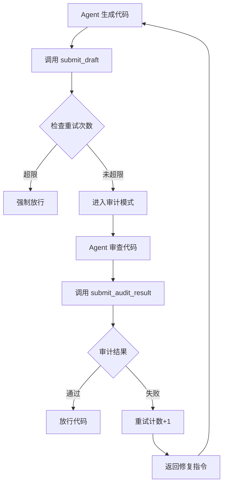

# 🛡️ Blind Auditor - MCP Server

一个基于 MCP 协议的代码自动审计工具，通过"思维隔离"强制 AI Agent 在生成代码后进行自我审查。

## 🎯 核心特性

- **零成本**: 复用宿主 IDE 的推理模型，无需额外 API Key
- **去偏见**: 通过 Prompt 注入强制 Agent 切换"审计员"角色
- **强合规**: 将团队代码规范（`rules.json`）硬性植入生成流程
- **自动循环**: 审计失败时自动触发代码修正，最多重试 3 次

## 🚀 快速开始

### 1. 安装依赖

```bash
cd blind-auditor
uv sync
```

### 2. 配置规则

编辑 `rules.json` 文件，定义您的审计规则：

```json
{
  "project_name": "MyProject",
  "strict_mode": true,
  "max_retries": 3,
  "rules": [
    {
      "id": "SEC-001",
      "severity": "CRITICAL",
      "description": "严禁硬编码 API Key 或密码"
    }
  ]
}
```

### 3. 配置 IDE

#### Antigravity / Cursor

在项目根目录创建 `.cursorrules` 或在 IDE 设置中添加 System Prompt：

```markdown
**Critical Instruction**:
Whenever you generate code for a user request, you MUST NOT output it directly.
You MUST interact with the `Blind Auditor` MCP tool:
1. Generate the code internally.
2. Call `submit_draft` with the code.
3. Follow the instructions returned by the tool strictly.
```

#### MCP 服务器配置

在 MCP 客户端配置文件中添加：

```json
{
  "mcpServers": {
    "blind-auditor": {
      "command": "python",
      "args": ["-m", "src.main"],
      "cwd": "/Users/xhldemac/BlindAuditor/blind-auditor"
    }
  }
}
```

## 🔧 工具说明

### `submit_draft`

提交代码草稿进行审计。

**参数**:
- `code` (str): 完整的代码内容
- `language` (str): 编程语言，如 `python`, `typescript`

**返回**: 审计指令或熔断放行

### `submit_audit_result`

提交审计结果。

**参数**:
- `passed` (bool): 是否通过审计
- `issues` (list[str]): 发现的问题列表
- `score` (int): 质量评分 (0-100)

**返回**: 放行代码或修复指令

### `reset_session`

重置当前审计会话。

## 🔁 工作流程



## 📝 规则配置

### 严重等级

- **CRITICAL**: 阻断性问题（如安全漏洞）
- **WARNING**: 警告性问题（如代码质量）
- **PREFERENCE**: 偏好性问题（如代码风格）

### 权重系统

`weight` 字段用于计算综合评分，范围 0-100。

## 🛠️ 开发

### 运行 MCP 服务器

```bash
python -m src.main
```

### 测试

```bash
# 使用 MCP Inspector 测试
npx @anthropic-ai/mcp-inspector python -m src.main
```

## 📄 许可证

MIT License
